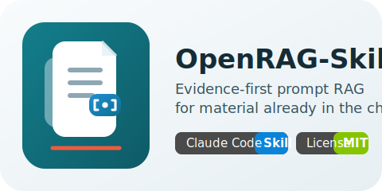

# OpenRAG-Skill

<p align="left">
  
</p>

[](./README.md)
[](./README_ZH.md)
[](https://docs.anthropic.com/en/docs/claude-code/skills)
[](./LICENSE)

OpenRAG-Skill 是一个面向 Claude Code 的开源 Skill，适合在资料已经进入对话时使用。它不做站外检索，不接向量库，也不假装知道上下文之外的内容。它做的事情很明确：把已提供文本整理成可引用的证据单元，让每条关键结论都能回到出处，资料不够时就直接拒答。

## 一眼看懂

| 这是什么 | 这不是什么 |
| --- | --- |
| 适合制度、手册、合同、规范说明、FAQ 等长文档的实用 Skill | 向量检索系统 |
| 一套把“证据处理”和“答案生成”分开的 Prompt 协议 | 网页、数据库或外部知识库检索层 |
| 一种输出稳定、方便人工复核和评测的回答方式 | 面向海量外部语料的通用 RAG 基础设施 |
| 一个边界清楚、可控性优先的工具 | 通用代码库搜索工作流 |

## 适用场景

适合这些情况：
- 用户把资料直接贴进对话；
- 会话里已经有政策、手册、规格文档；
- 系统提示已经提前注入了参考材料。

如果资料根本不在上下文里，正确做法不是猜，而是直接指出缺口并要求补充材料。

## 你能得到什么

OpenRAG-Skill 的价值不在“更花哨”，而在“更稳”：

| 能力 | 实际效果 |
| --- | --- |
| Evidence Units | 把原始材料整理成稳定、可引用的证据编号 |
| 两段式流程 | 先定位证据，再写答案，减少随手发挥 |
| 规范力度锁定 | 把 `SHALL`、`SHOULD`、`MAY` 分开，不让它们混成一句话 |
| 固定输出合同 | 结果结构稳定，方便复核、对比和评测 |
| 拒答约束 | 证据不够时返回 `INSUFFICIENT_EVIDENCE`，而不是硬答 |

## 协议流程

```text
已提供的上下文
  -> Evidence Units
  -> Coverage Table
  -> 证据 / 冲突核对
  -> Final Sweep
  -> 带引用的答案
```

流程本身很直接：

1. 先把输入材料整理成 `Evidence Units`。
2. 把任务拆成必须被证明的最小问题集。
3. 为每个子问题绑定最小充分证据。
4. 检查冲突、范围、日期、版本和例外条款。
5. 证据账本清楚后，再生成最终答案。

## 输出合同

顶层输出顺序固定为：

```text
Answer
Evidence Map
Conflicts or Gaps
Need More Material   （仅在部分回答或拒答时出现）
```

基本规则：
- 每条关键结论都必须有证据引用。
- 没证据的内容不写。
- 资料没写到的内容，直接写 `not specified in the provided evidence`。
- 中间过程默认不外显，除非用户明确要求看中间产物。

`compare` 模式需要更严格：
- 只有在“范围一致、规范力度一致”时，内容才可以放进 `Shared Ground`。
- 如果一边是 `SHALL`，另一边是 `SHOULD` 或 `MAY`，就必须放进 `Differences`。
- 如果只是“主题接近”而不是同一条规则，`Shared Ground` 应该写 `None.`。
- `Bottom Line` 只能复述已经证明的差异，不能临时发挥。

## 安装方式

把仓库安装成 Claude Code Skill，然后确保资料已经在对话里，再用 `$rag` 调用。

个人安装：

```bash
mkdir -p ~/.claude/skills/rag
cp -R . ~/.claude/skills/rag
```

项目内安装：

```bash
mkdir -p .claude/skills/rag
cp -R . .claude/skills/rag
```

## 起步提示词

```markdown
请使用 $rag，只根据下面的材料回答，并为每条关键结论附上引用。

[CONTEXT]
Source A:
<在这里粘贴第一份文档>

Source B:
<在这里粘贴第二份文档>

[TASK]
总结审批规则，并为每条关键结论附上引用。

[OUTPUT_MODE]
answer
```

## 为什么它比“直接问一句”更稳

长文档问答常见的问题其实很固定：看到第一条相关内容就下结论，把例外条款压扁成默认规则，把强制要求说成建议，或者在资料不完整时继续补全。

OpenRAG-Skill 用的是相反的做法：
- 先证据，后结论；
- 严格区分规范力度；
- 不外泄中间过程；
- 证据不够就拒答。

## 示例

- [`examples/document_qa.md`](./examples/document_qa.md)：简单问答
- [`examples/long_policy_constraints.md`](./examples/long_policy_constraints.md)：长文档约束汇总
- [`examples/conflict_resolution.md`](./examples/conflict_resolution.md)：冲突处理
- [`examples/insufficient_evidence.md`](./examples/insufficient_evidence.md)：证据不足时的拒答
- [`examples/multi_source.md`](./examples/multi_source.md)：多来源对比

## 评测

仓库内置了文档型评测集，放在 [`evals/`](./evals/)：
- 事实查询
- 约束召回
- 冲突处理
- 拒答行为
- 引用对齐
- 规范力度漂移
- 措辞敏感场景

目标很直接：这套 Skill 不靠隐藏基础设施，也能被直接测、直接比较。

## 仓库结构

```text
OpenRAG-Skill/
|-- SKILL.md
|-- README.md
|-- README_ZH.md
|-- agents/openai.yaml
|-- assets/
|-- references/
|-- examples/
|-- evals/
`-- LICENSE
```

## 发布前说明

- 对外项目名使用 `OpenRAG-Skill`。
- Skill 调用名仍然是 `$rag`。
- 这套协议本来就是“边界明确”的工具，边界写清楚反而更可信。

## 许可证

采用 MIT License，见 [`LICENSE`](./LICENSE)。
